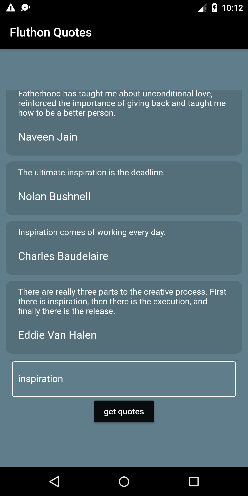

# `Fluthon APP`

 A new Flutter project which is supported from a python script and lists quotes .


## `Deployment`  📲

```bash
-> /Script - python main.py.

```
```
-> Run main.dart in the flutter project.
```
```
-> Fill in the data (Eg:- Motivation/Inspiration) in the provided space.
```

## 🛠 `Libraries Used`

- Flask
- request
- jsonify
- BeautifulSoup

## 📱 `Demo `

<h2 align= "left"><b>Quotes screen</b></h2>
<p align="left">
  
   &ensp;

## `LICENSE`

Licensed under the [MIT LICENSE](LICENSE).
